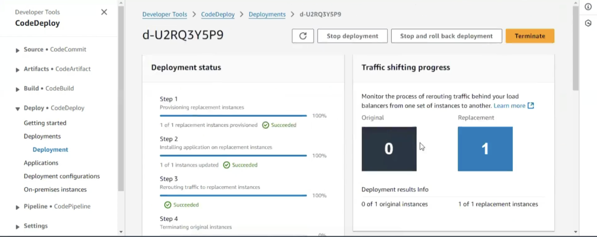
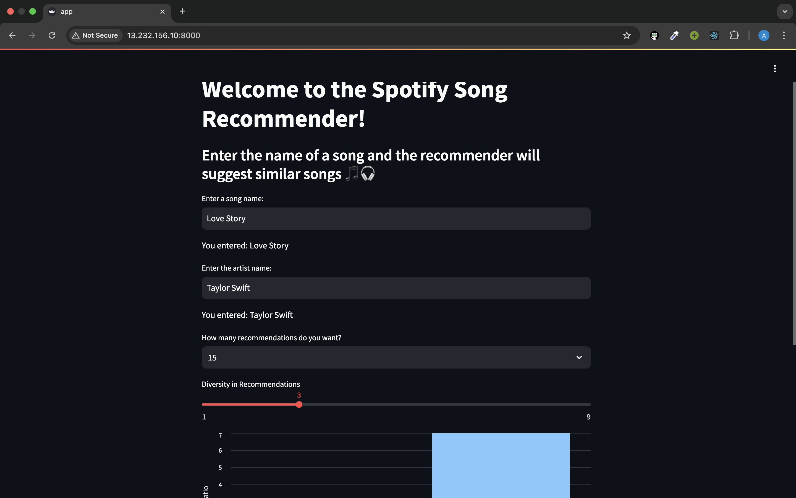
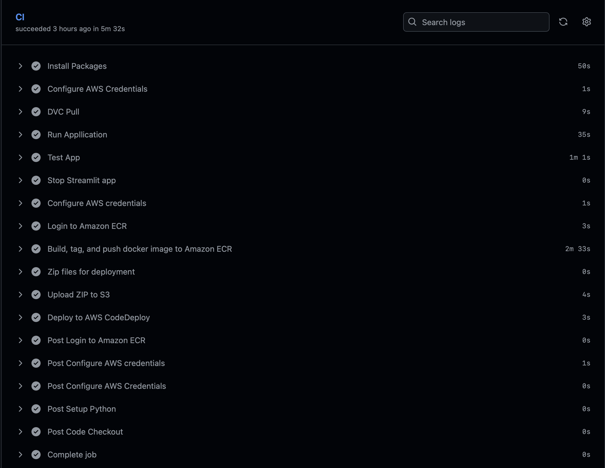

# 🎧 Spotify Hybrid Recommender System

A full-stack hybrid recommender system that combines **content-based filtering** and **collaborative filtering** to suggest songs aligned with user preferences. Built with Python and Streamlit, integrated with AWS for scalable deployment and dynamic data access.

---

## 🚀 Features

- 🎵 **Collaborative Filtering**: Uses user listening history and cosine similarity on sparse matrices.
- 🧠 **Content-Based Filtering**: Leverages metadata like artist, genre, tempo, and more.
- 🔄 **Hybrid Mode**: Combines both methods for balanced and accurate recommendations.
- ☁️ **Cloud Deployment** — Deployed on Streamlit Cloud and AWS EC2 using a CI/CD pipeline.


---

## 🖼️ Demo

🔗 **Live App**: [Streamlit App](https://aditya2600-spotify-hybrid-recommender-system-app-nw68nq.streamlit.app)


---

## 🛠️ Tech Stack

| Tool                | Purpose                             |
|---------------------|-------------------------------------|
| Python              | Core development language           |
| Pandas, NumPy       | Data processing & manipulation      |
| Scikit-learn, SciPy | Similarity calculations             |
| Dask                | Parallel computation on large data  |
| Streamlit           | Web UI                              |
| AWS EC2/S3/ECR      | Deployment, storage, and images     |
| Docker              | Containerization                    |
| GitHub Actions      | CI/CD automation                    |

---

## 📁 Project Structure

```
spotify-hybrid-recommender-system/
│
├── app.py                         # Streamlit entry point
├── collaborative.py               # Collaborative filtering logic
├── content_based.py               # Content-based filtering logic
├── hybrid.py                      # Hybrid recommender
├── data/
│   ├── transformed_data.npz       # Collaborative sparse matrix
│   ├── track_ids.npy              # Index-to-ID mapping
│   ├── collab_filtered_data.csv  # Metadata for content-based filtering
├── utils/
│   ├── preprocessing.py           # Data cleaning functions
│   └── aws_utils.py               # S3 integration
├── deploy/
│   └── scripts/                   # EC2 Docker startup and setup
├── notebooks/                     # EDA and model tuning
├── requirements.txt
└── README.md
```
---

## 📦 Installation & Running Locally


### 1. Clone the repository
```bash
git clone https://github.com/Aditya2600/SPOTIFY-HYBRID-RECOMMENDER-SYSTEM
cd spotify-hybrid-recommender-system
```


### 3. Install dependencies
```bash
pip install -r requirements.txt
```


### 5. Run Streamlit app
```bash
streamlit run app.py
```

⸻

## 🔍 Datasets Used
	•	User Listening History.csv: User-song interaction dataset.
	•	collab_filtered_data.csv: Final dataset for content-based filtering.
	•	transformed_data.npz: Sparse matrix from collaborative filtering.
	•	track_ids.npy: Index to song ID mapping.


⸻

## 🧪 Recommender Modes


### 1. 🎯 Content-Based

Uses song metadata like tempo, genre, duration, mode, etc.

from content_based import get_content_recommendations
recommendations = get_content_recommendations(song_title)

### 2. 🤝 Collaborative Filtering

Based on user behavior similarity using cosine similarity on sparse matrix.

from collaborative import get_collab_recommendations
recommendations = get_collab_recommendations(song_title)

### 3. 🔁 Hybrid

Combines both approaches with custom weights.

from hybrid import get_hybrid_recommendations
recommendations = get_hybrid_recommendations(song_title)

---

## ☁️ Deployment Overview

This project is deployed using a fully automated CI/CD pipeline on AWS. The infrastructure and flow include:

- 🚀 **CI/CD via GitHub Actions** – Automates build, test, and deployment steps.
- 📦 **Dockerized Application** – The app is containerized using Docker for consistency across environments.
- 🐳 **Amazon ECR (Elastic Container Registry)** – Stores and manages the Docker image.
- 📁 **Amazon S3** – Hosts the deployment bundle (`appspec.yml`, shell scripts, etc.) used by CodeDeploy.
- 🤖 **AWS CodeDeploy** – Handles the automated deployment process to the EC2 instance.
- 💻 **EC2 Instance (Ubuntu)** – Runs the production-ready Streamlit app.

> 💡 The deployment is production-grade, enabling seamless updates with each `git push`.

---
## ☁️ Deployment Snapshots

<p align="center">
  
  
  
</p>

### ✅ CI/CD Log Snapshot

<p align="center">
  
</p>

⸻

🧾 Credits
	•	Kaggle Million Song Dataset
	•	Scikit-learn & SciPy community
	•	Streamlit Cloud for deployment

⸻

📄 License

This project is licensed under the MIT License.

⸻

🙋‍♂️ Author

Aditya Meshram
🎓 B.Tech IT | NIT Raipur


⸻


